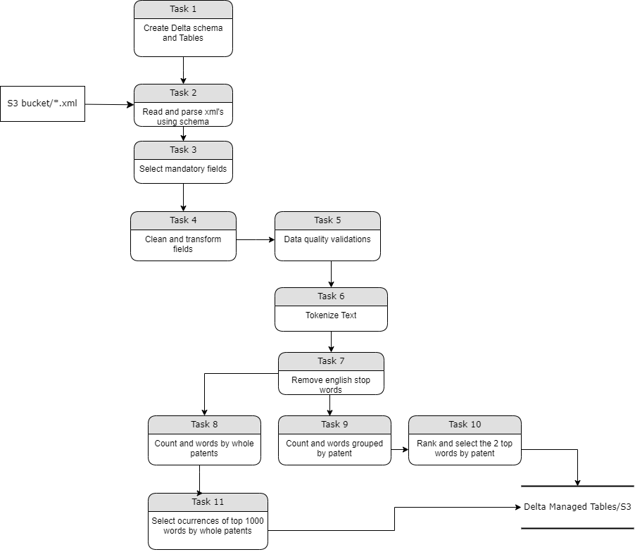

# BASF CODING CHALLENGE

## Task 1: Design your data ingestion pipeline
* Sketch how you would approach problem with a simple high-level diagram. You can use a block, sequence, or a data model diagram for example.

## Proposed Solution for Task 1
### High level diagram of the process

## Task 2: Develop your pipeline
* Build a document processing pipeline that could (potentially) scale up to ~100 million documents which meets the requirements in the description of the problem.

## Proposed Solution for Task 2
* The process was implemented into the PySpark script `basf_challenge_script.py` that read the XML files stored into S3 bucket.

### Software Requirements
* PySpark 3.1
* Python >=3.7
* It is needed to install the jar `spark-xml_2.12-0.17.0.jar` in the Spark cluster to allow the XML parsing through the format `com.databricks.spark.xml`.

### Cluster Configuration
* The script was executed using a AWS Glue Job, using the following configuration:
    * glue_version=3.0
    * worker_type=G.1X (4vCPU and 16GB RAM)
    * number_of_workers=5
* Moreover, it was necessary to set the following parameters into the Glue's job configuration:
    * Set config variable: `--datalake-formats=delta`
    * Set the options in the Spark Context:
        * `spark.sql.extensions=io.delta.sql.DeltaSparkSessionExtension`
        * `spark.sql.catalog.spark_catalog=org.apache.spark.sql.delta.catalog.DeltaCatalog`
    * All above options are required to allow the interaction with Delta module.
    * AWS Glue has the module Delta preinstalled.
